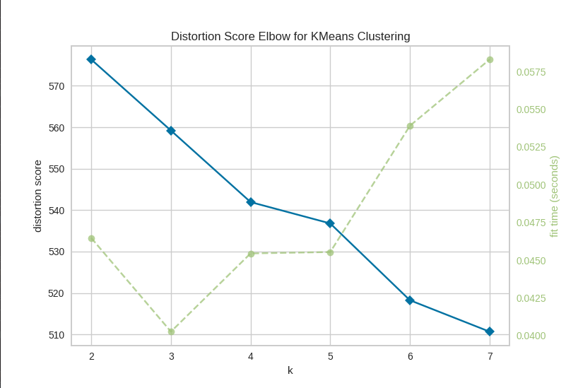
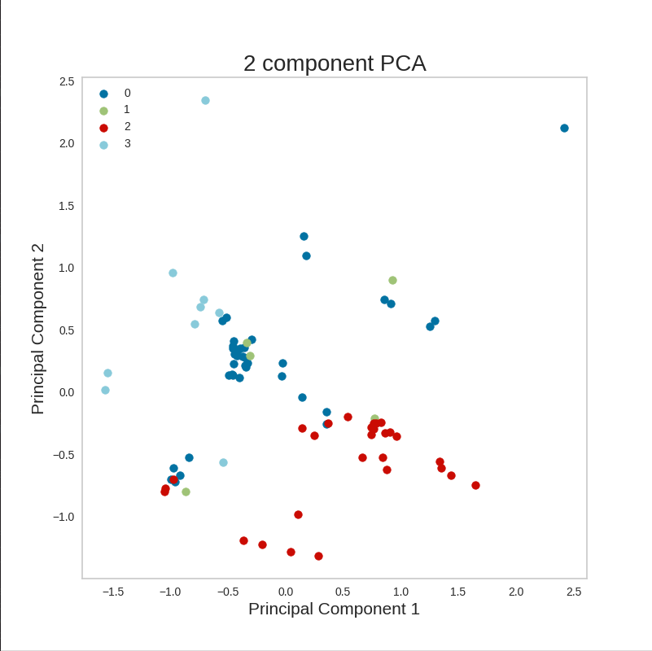
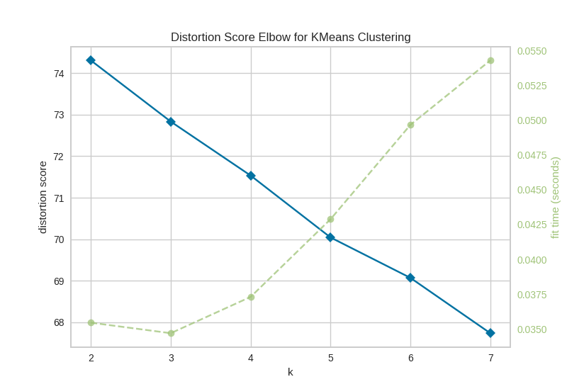
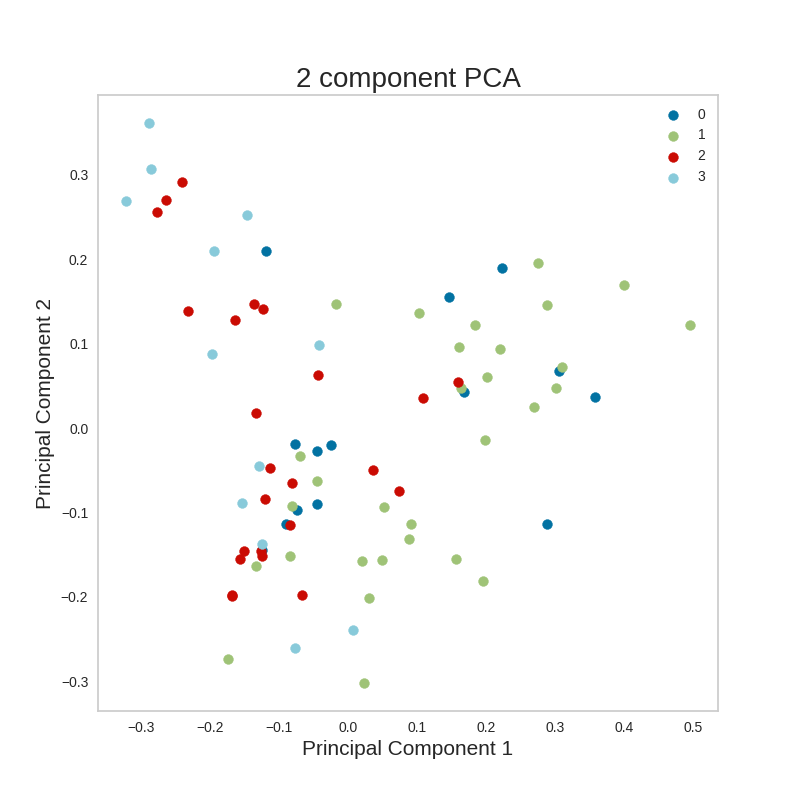
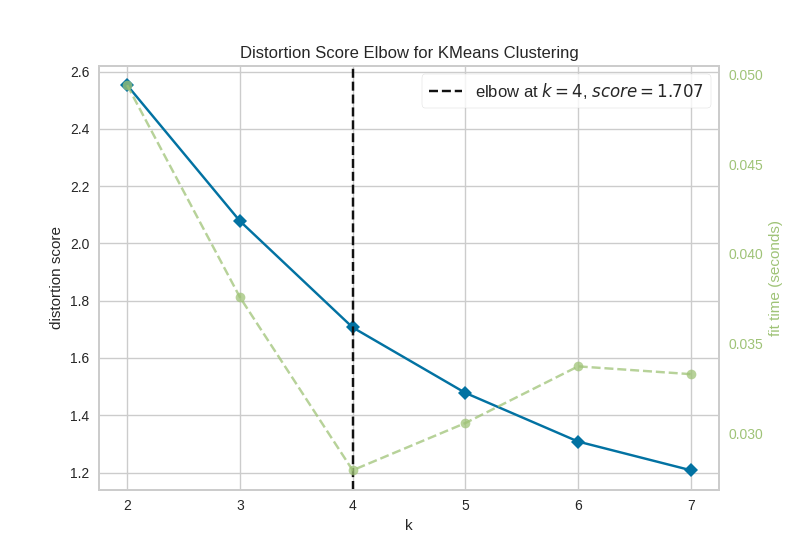
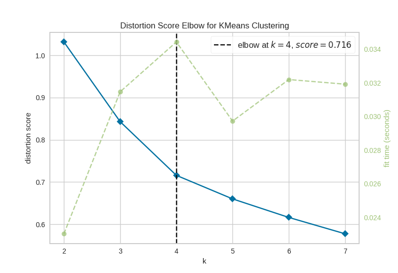
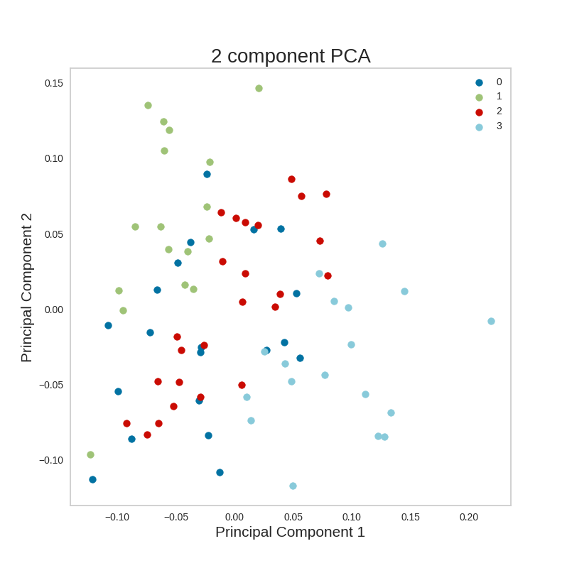
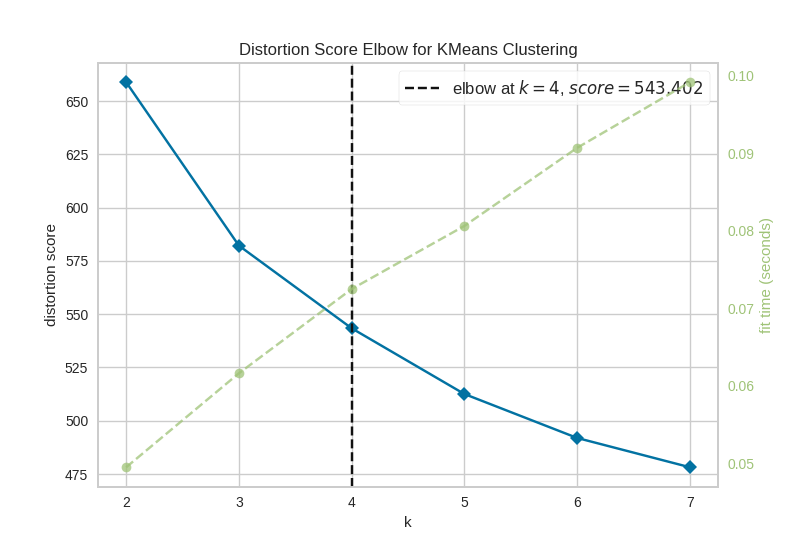
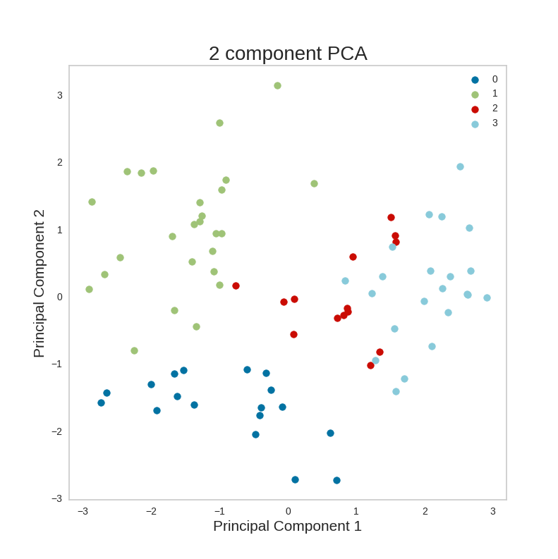

# rilla-voice-tech-challenge

Models Trained

1. One hot encoding clustering on cleaned data

        Average silhouette_score : 0.025480204169789522

    
    

    Cleaning Pipeline:
    a. Use spacy to detect the entities and replace the entities text as entities. eg. replaced google as org
    b. removed stopwords and lemmatized

    To run the model:

        cd modules/clustering
        python one_hot_clustering.py

2. Tf-Idf Clustering on cleaned data

        Average silhouette_score : 0.006704295826363957

    
    

    Cleaning Pipeline:
    a. Use spacy to detect the entities and replace the entities text as entities. eg. replaced google as org
    b. removed stopwords and lemmatized

    To run the model:
    
        cd modules/clustering
        python tf_idf_clustering.py

3. Fasttext vectors trained on uncleaned data

        Average silhouette_score : 0.17497733

    
    

    Cleaning Pipeline:
    No Cleaning

    To run the model:
    
        cd modules/clustering
        set cleaning variable as False
        python fasttext_clustering.py

4. Fasttext vectors trained on cleaned data

        Average silhouette_score : 0.15030155

    
    

    Cleaning Pipeline:
    a. Use spacy to detect the entities and replace the entities text as entities. eg. replaced google as org
    b. removed stopwords and lemmatized

    To run the model:
    
        cd modules/clustering
        set cleaning variable as True
        python fasttext_clustering.py

5. Sent2vec clustering

        Average silhouette_score : 0.110265754

    sent2vec_
    
    

    Cleaning Pipeline:
    No Cleaning

    To run the model:
    
        cd modules/clustering
        python sent2vec_clustering.py

## Instructions

Add the path to the git folder in the PYTHONPATH

    export PYTHONPATH="$PYTHONPATH:~/rilla-voice-tech-challenge"